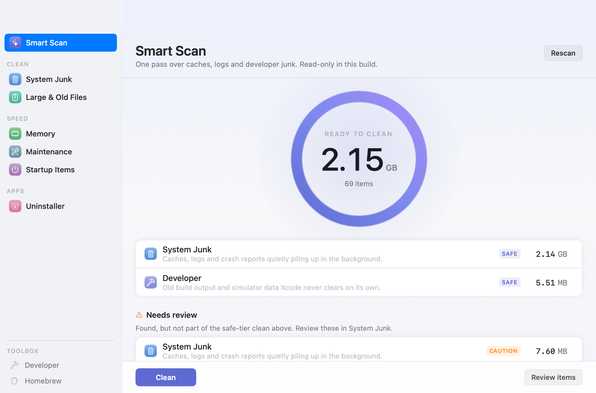
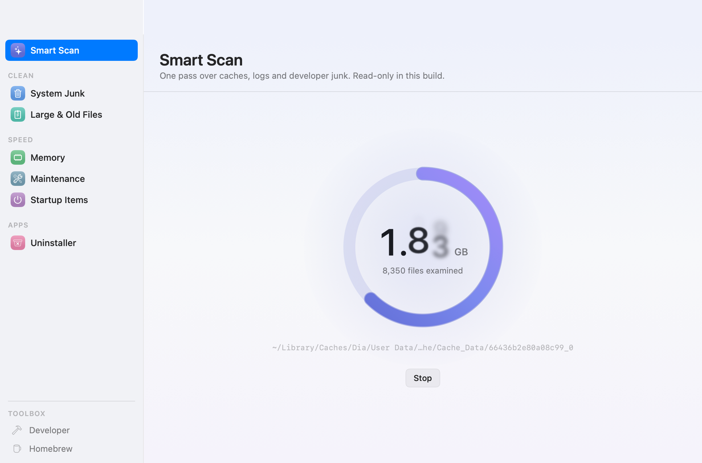
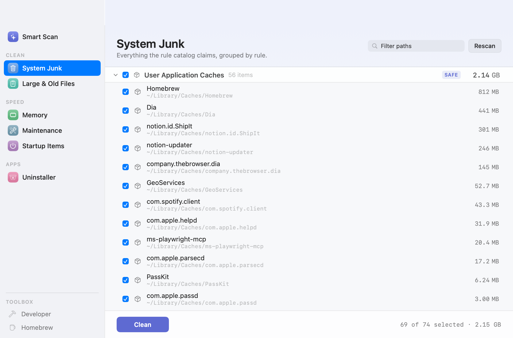
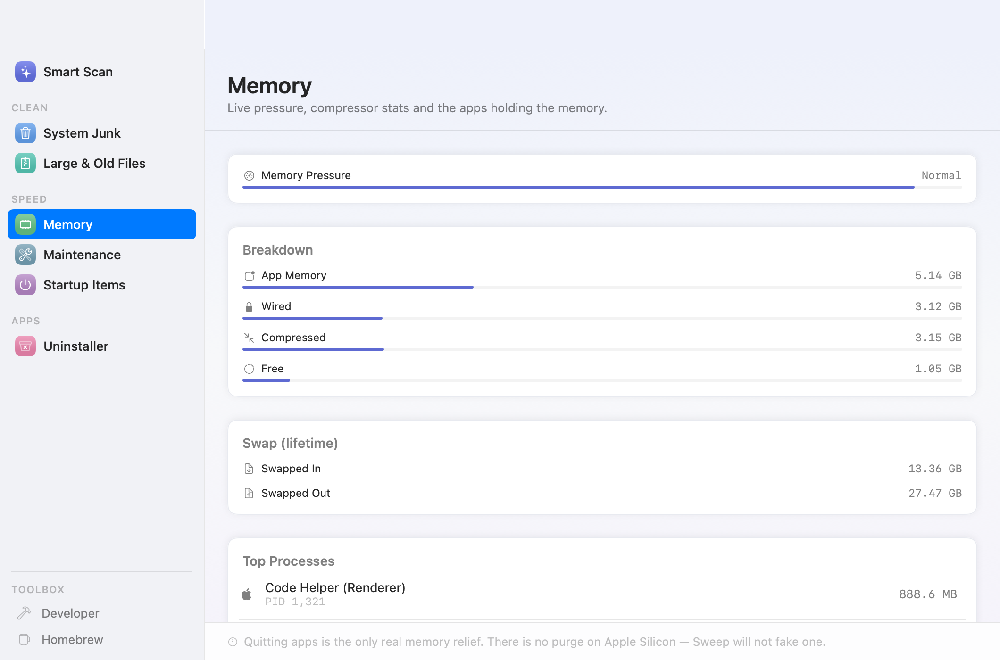
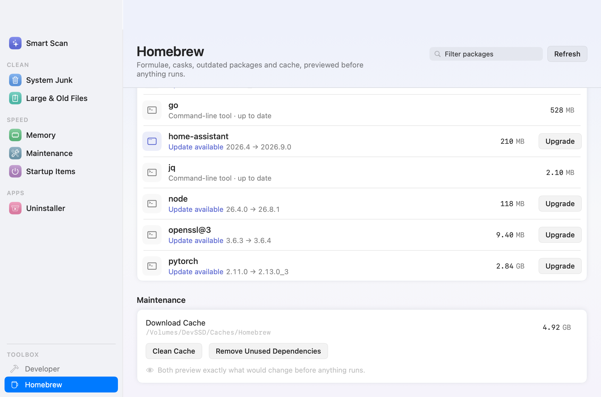

# Sweep

**A native, open-source Mac cleaner. Honest numbers, real safety, no placebo.**


<p align="center">
  
</p>

Sweep is a CleanMyMac-style utility built entirely in Swift 6 + SwiftUI, as a from-scratch open-source take on the category. It scans the junk that actually accumulates on a developer's Mac — app caches, logs, crash reports, Xcode build output, simulator data, Homebrew downloads — shows you honest, inode-deduplicated numbers, and (behind explicit safety gates) cleans trash-first with a journaled, reversible pipeline.

> Sweep is an independent project. It is not affiliated with, endorsed by, or connected to MacPaw or CleanMyMac in any way.

## Philosophy

- **Honest metrics.** Every byte shown is deduplicated by inode (hard links and APFS clone families counted once) and scoped to what would actually be cleaned. If a number can't be computed honestly, Sweep shows nothing.
- **Read-only by construction.** Scanning code is architecturally incapable of writing — deletion machinery lives behind a separate, gated execution path with its own adversarial-review process (see `PLAN.md`).
- **Trash-first, journaled.** Nothing is ever `unlink`ed. Cleans move items to Trash with a write-ahead journal and per-item outcomes, and every failure explains itself and how to fix it.
- **No placebo.** There is no "free RAM" button, because on Apple Silicon there is no such thing. Quitting the apps that hold the memory is the honest relief, so that's what the Memory screen offers.
- **Fast the real way.** Bulk directory syscalls (`getattrlistbulk`), parallel root walks, and one-walk-many-matches caching — measured, not vibed.

## What's inside

| Module | What it does |
|---|---|
| **Smart Scan** | One pass over caches, logs and developer junk, with a determinate progress ring driven by real scan progress |
| **System Junk** | Full rule-by-rule review: search, per-item selection, safety tiers, reveal-in-Finder |
| **Large & Old Files** | The big forgotten files, sorted and dated |
| **Memory** | Live pressure, compressor stats, top processes with their app icons and real quit buttons |
| **Maintenance** | Typed, preview-first housekeeping commands |
| **Startup Items** | Login items and launch agents, explained |
| **Uninstaller** | AppCleaner-class removal: leftover matching by bundle identity with evidence and confidence tiers, drag-a-.app-anywhere support, instant selection via a pre-walked index |
| **Toolbox: Developer** | Xcode DerivedData, device support, simulator caches |
| **Toolbox: Homebrew** | A typed GUI over `brew`: outdated packages, one-click Update All with live progress, cache cleanup — every mutation preview-first |
| **Menubar** | A standalone, memory-budgeted monitor process |

<table>
  <tr>
    <td></td>
    <td></td>
  </tr>
  <tr>
    <td></td>
    <td></td>
  </tr>
</table>

## Current status

Sweep is under active development. The scan/review pipeline, Memory, Maintenance, Startup Items, Uninstaller analysis, and the Homebrew/Developer toolboxes are live. **Destructive actions (Clean, uninstall execution) are gated off in this build** while their safety pipelines finish adversarial review — the UI shows the gates explicitly. `PLAN.md` is the canonical roadmap; `BUILDLOG.md` is the running engineering log.

## Building

Requirements: macOS 15+ with the Swift 6 toolchain (Xcode 16+); the app targets macOS 26.

```sh
git clone https://github.com/asreerama/sweep.git
cd sweep
swift build          # packages + app
swift test           # full suite
./scripts/build-app.sh   # signed .app into ~/Applications (self-signed; see script header)
```

`scripts/make-fixtures.sh` generates a deterministic fake junk tree, so you can exercise the scanner without pointing it at your real home (`SWEEP_HOME=<fixture-dir>`).

## Architecture

Eight targets with deliberately boring dependency rules:

```
SweepPolicy      path policy, denylist, XPC vocabulary        (depends on nothing)
SweepCore        scan engine, rules, clean service, journal   (→ SweepPolicy)
SweepSystem      memory/CPU/disk sampling                     (depends on nothing)
SweepUninstall   app inventory + leftover matching            (→ SweepPolicy)
SweepUI          design system: tokens, motion, components    (depends on nothing)
SweepApp         shell, screens, models                       (→ all of the above)
SweepHelper      privileged helper daemon                     (→ SweepPolicy; XPC only)
SweepMenu        standalone menubar process                   (→ SweepSystem)
```

The rules that keep it honest: `SweepUI` never sees real data types (screens bind through adapters); the app and helper never import each other (XPC only); `SweepCore`'s pinned contracts change only through adversarial review. The full safety architecture — rule tiers, deny-wins policy, deletion journal, identity revalidation — is specified in [`PLAN.md`](PLAN.md), and the helper-side scanning question is analyzed in [`HELPER-SCAN-DESIGN.md`](HELPER-SCAN-DESIGN.md).

## Contributing

Contributions are welcome — including agent-written ones, which much of Sweep is. Read [`CONTRIBUTING.md`](CONTRIBUTING.md) first: it carries the build/test commands, the coding standards (they are enforced), the documentation requirements, and the PR checklist that acts as the merge gate. Scan-safety issues should go to email, not the public tracker — see the security note there.

## License

[MIT](LICENSE) © 2026 Aditya Sreerama.

Approach credits: [Pearcleaner](https://github.com/alienator88/Pearcleaner) (open source, whose leftover-location knowledge informed the uninstaller's search roots) and the category CleanMyMac defined. All code here is original to this project.
